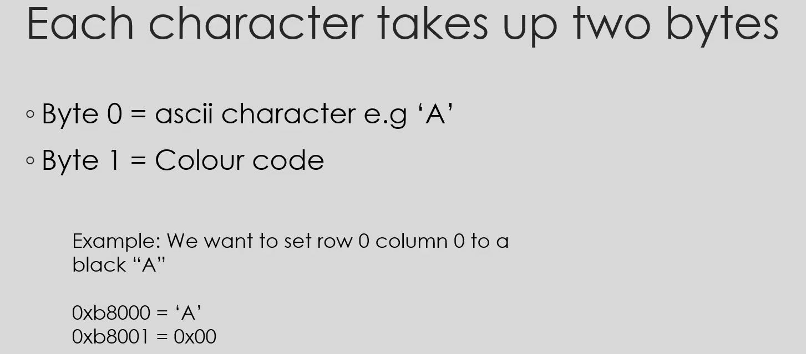

# OS Project

> Ralph Browns interrupt list

### Make the binary file

  nasm -f bin boot.asm -o boot.bin

### View the binary assembly

  ndisasm ./boot.bin

### To run the program

  qemu-system-x86_64 -hda ./boot.bin 

> For loading the program in memory , 16 is multiplied to the hex bit of segment register
> Eg : 0x7c0 in segment register becomes 0x7c00 memory address
> Absolute address = stack segment * 16 + stack pointer

## To write bootloader to file do

`sudo dd if=./boot.bin of=/dev/sdb`

## Interrupts

All interrupts are of 4 bytes , and start at 0x7c0 . There are 256 interrupts.

Interrupt 0 = address 0x00
Interrupt 1 = Address 0x04
Interrupt 2 = Address 0x08

first two bytes are interrupt offset , second two are interrupt segment.

## Protected Mode

    Allows 4gb of memory usage

### Process

    1. Make a linker file and a Makefile to compile all the files into an object file kernelfull.o and then use i686-elf-gcc to compile a kernel.bin binary file using the linker file without any dependencies, so that the kernel file can run without any environment.

### 1. Global Descriptor Table (GDT)

### 2. GDB run

    Add symbols (gdb) `add-symbol-file ./build/kernelfull.o 0x100000`
    Run the qemu (gdb) `target remote | qemu-system-x86_64 -hda ./bin/os.bin -S -gdb stdio`
    break kernel_main
    To continue (gdb) c 
    To backtrace (gdb) bt
    layout asm
    info registers

### 3. Processor bus

    Used to communicate with hardware connected to motherboard, we will use it to enable fast A20

### 4. Text mode

This has 16 bits of color scheme.
Coloured output is done to 0xB8000.
Monochrome output is done to 0xB0000.

### 5. Interrupt Descriptor Table
In real mode we use interrupt vector table , but in protected mode we need to set up and use interrupt descriptor table.
It describes how interrupts are invoked in protected mode.
Trap gates are like interrupt gates but they are used for exceptions.
